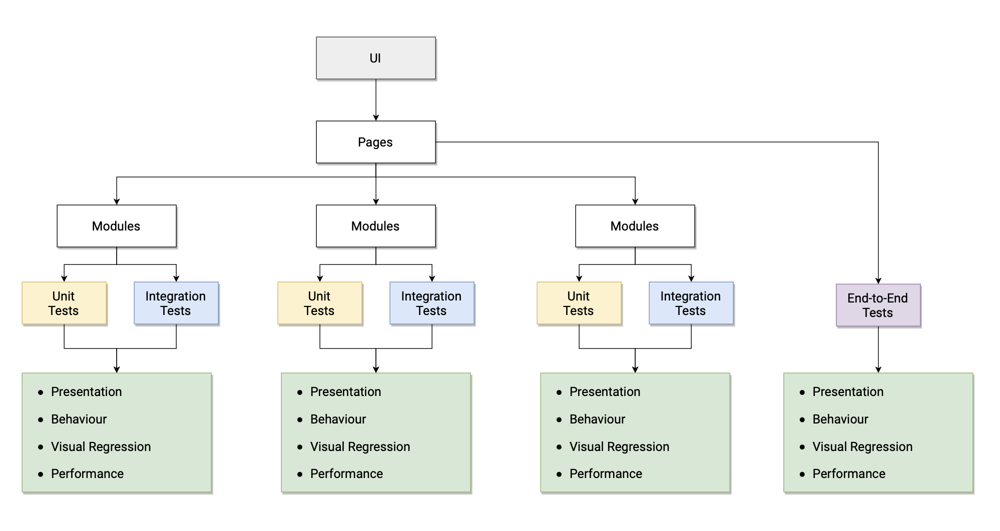
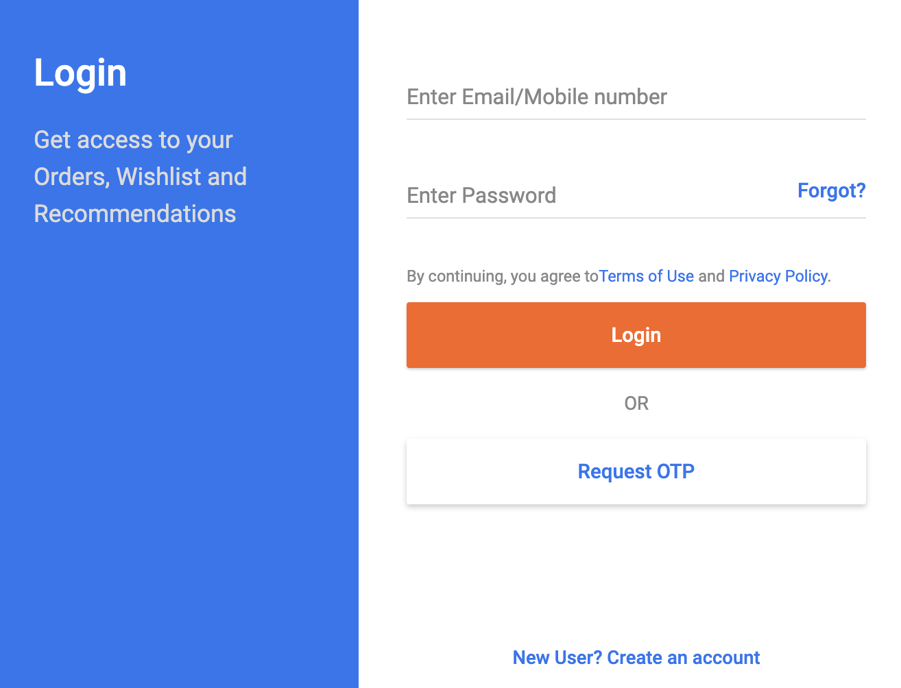
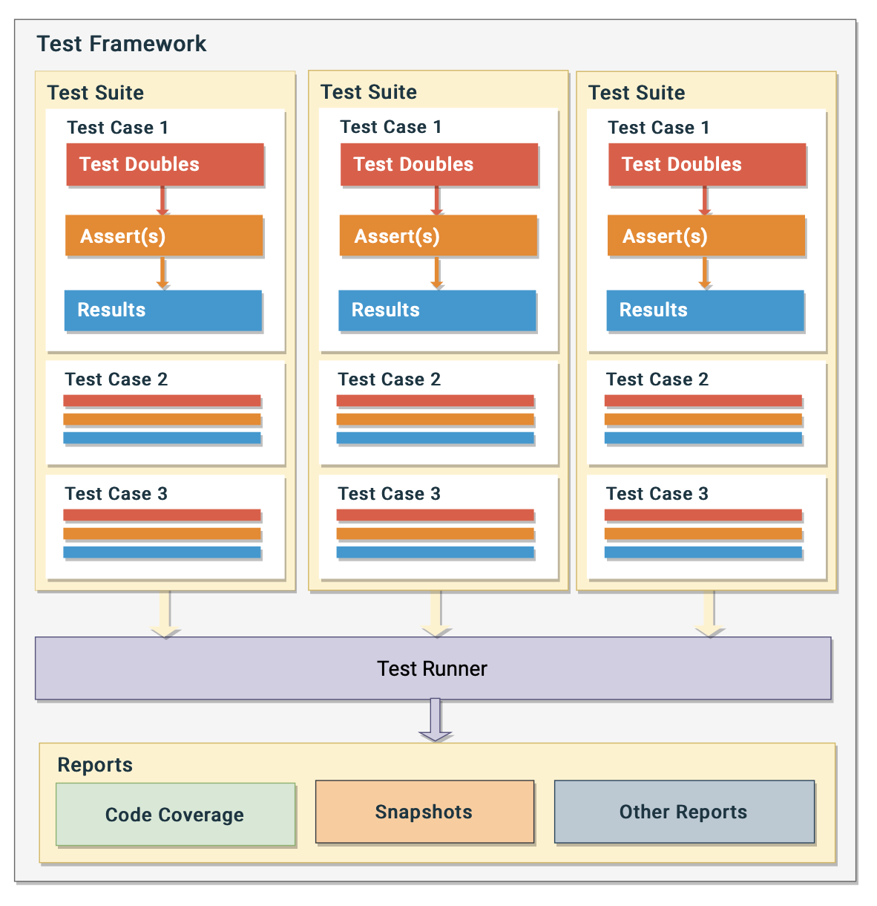

# A Beginner's Experience with Automated UI Testing

I’m **Ganesh**, and I'm a **lead frontend engineer** at **Publicis Sapient**. I've been creating JavaScript applications for years now, but did not work much with automated **UI testing**.


As crazy as it may seem, but that's how it has been for me. But I decided to changed this and lately I've spent a lot of time to learn as much as I can about automated **UI testing**.

To help fellow frontend folks who are just getting started with UI testing, I decided to document my experiences here so that they can find all the concepts at one place, and could get started quickly.

Shoutout 🙌 to **frontendnachos** for guiding me in my journey and helping me put this piece together.

This post will touch upon the following areas:
- Explanation of automated UI testing
- Necessity of automated UI testing
- Different types of automated UI testing
- Different Components of a UI testing framework
- Quick Look at Some UI testing tools

> Note: 
> 1. The code snippets that I have added to the post are written using JEST because I've been working with it. But that does not make this post a JEST tutorial. So DO NOT CONSIDER this post as a definitive guide to JEST.
> 2. To make the concept description easier to understand, I have occasionally compromised on some best practises.

Let's get started.


## Automated UI Testing Explained

It is the process of checking how an application's UI will respond in different situations.

An application's UI is made up of modules that can be put into the following categories:

| Module Type 	| Description 	| Example 	|
|---	|---	|---	|
| Presentational 	| Concerned with how things look. <br> These parts are unaware of the business logic. 	| Input field, Range Slider, <br> Button, etc.	|
| Container 	| Concerned with how things work. <br> These parts are aware of the business logic. 	| Login Form, Products List, <br> Payment module, etc. 	|
| Page 	| Different application pages made up of <br> **presentational** and **container** modules. 	| Login Page, Dashboard Page, <br> Checkout Page, etc. 	|

The aim of UI testing is to validate all the above module types, and the following are the types of validations that apply to the process:

| Testing Type 	| Description 	|
|---	|---	|
| Unit 	| Validates the logic and behaviour of an individual module <br> but not the ones that it depends upon or interacts with	|
| Integration 	| Validates the combined the logic and behaviour of <br> the a module, and the ones it depends upon and interacts with 	|
| End-to-End 	| Simulates how an actual user interacts with the application <br> and validates user journeys 	|

These testing types can comprise of tests that validate:

| Aspect 	| Description 	|
|---	|---	|
| Presentation 	| The rendering and the visual aspect of modules |
| Behaviour 	| Validation of output values against certain input values  |
| Visual Regression 	| Validates how the visual appearance of a module gets impacted <br> as more core is added to it  |
| Performance Testing 	| Validates the stability, responsiveness and speed of the module |

In the end, all the validation outcomes are compiled into reports that can be shared with product owners and development teams.

So to summarize, this is what it looks like:




# Need for Automated UI Testing

When a user interacts with an application's UI, the UI needs to ensure the following things:
1. The user should always see the correct data in the right format
2. The user input should be reliably captured and processed
3. The user should always get an acknowledgment once their actions have been registered or processed

When all of the aforementioned criteria are met, everyone is joyful and celebrating.


But when any of these conditions are not met, chaos ensues. In addition to having an adverse effect on product conversions, it also damages the brand's reputation. And we all understand what that entails.


So before a module is included in a product's release, it is critical to **thoroughly validate each and every aspect of it**. There are many moving pieces in a live app, and any one of them could malfunction at any time. While the teams work to get things up and running, the users shouldn't feel abandoned.

It takes a lot of meticulous testing to get the UI to the point where it can be considered mature enough to handle both positive and negative events. Additionally, manual validation results in:
1. A slower "time to market" for new features
2. Lack of confidence given that human error is always possible
3. Additional Expenses

Therefore, it is crucial to invest in **automated UI testing** to bring the UI to a robust state without making any of the aforementioend tradeoffs.


# Types of UI Testing

As stated during the **explanation of automated UI testing**, there are 3 types of UI testing and now we'll discuss each of those in detail:

|  	| **Unit Testing** 	| **Integration Testing**	| **End-to-End Testing** 	|
|---	|---	|---	|--- |
| **Objective** 	| To test the smallest modules and show that they are individually correct.	| To test modules in groups and make sure they function properly when combined. | To test whether there are any difficulties in the user journeys, engage with the app like a user would. |
| **Inference** 	| Concerned with the functionalities of the samllest independent modules. Not intended to cover system-wide issues.	| Aids in recognising potential problems that might occur when various modules interact with one another. | Aids in spotting potential problems that might occur when an actual user navigates through modules and interacts with the UI. |
| **Occurence**	| Can be executed anytime.	| Executed only after unit testing is complete. | Executed only after integration testing is complete. |
| **Abstraction** 	| These tests are white-box ones. Details of the module's implementation are known.	| Gray-box tests in a manner. It is necessary to have a fundamental understanding of module implementation. | Black-box tests. Module implementation details are not known. |
| **Dependencies** 	| Unit testing does not apply to any foreign modules. Thus, pre-defined inputs are used to fake the dependencies. | Integration testing covers communication with other modules. They are therefore also loaded and invoked. However, as it can lengthen the test-case execution time, network calls can be faked. | End-to-End testing covers interactions with external modules. They are therefore also loaded and invoked. However, as it can lengthen the test-case execution time, network calls can be faked. |
| **Debugging Complexity**	| Debugging is straightforward as the focus is only on one module	| Debugging is relatively more complicated than unit-tests as they validate groups of modules. | These are the most complicated ones to debug as there are multiple modules in focus. |
| **Maintenance**	| Maintenance is easy and inexpensive as the impact radius is small	| Maintenance is complex and relatively more expensive as impact radius is comparatively bigger. | Maintenance is complicated as the impact radius is huge. |
| **Tools**	| [JEST](https://jestjs.io), [JASMINE](https://jasmine.github.io), etc.	|  [JEST](https://jestjs.io), [JASMINE](https://jasmine.github.io), etc.  | [CYPRESS](https://cypress.io), [WEBDRIVERIO](https://webdriver.io), etc.  |

### Example

Consider the following UI:



- **Unit Testing** validating components such as input fields, links, buttons and login API function in isolation with faked foreign interactions such as API calls, etc.

- **Integration testing** would be validating the whole login form.

- **End-to-End** testing i.e. validating an entire user journey would comprise doing the following steps just as an actual user would,
    - Land on the login page,
    - Click on the "Forgot?" link,
    - Go to the forgot credentials page and reset credentials through an email link
 
 # Elements of Automated UI Testing

 In order to implement the UI test-cases in an application, one needs to understand the following concepts:

 <!-- > Note: For code examples of different concepts, the product listing page of an online marketplace has been assumed and, test-case snippets for features like "add-product-to-cart" and "add-product-to-wishlist" have been included. -->

 ## Test Case
 It is the smallest unit in the testing approach hierarchy. It comprises of a series of steps to be executed, as well as some verification, which is simply a comparison of the outcome with the desired outcome. For example
 ```js
 test('check if 2 + 3 = 5', async () => {

    expect( add(2,3).toBe(5) );

 })
 ```

 ## Test Suite
 An assembly of connected test cases is known as a test suite. The manageability is increased when relevant test cases are grouped together inside of a test suite. The grouping may be done according on execution time, type, etc. For example
 ```js
 describe('check if the multiplication function works correctly in all scenarios', () => {

    test('when all inputs are greater than 0', async () => {
        //Test commands go here
    });

    test('when only one input is greather than 0', async () => {
        //Test commands go here
    });

    test('when even number of inputs less than 0', async () => {
        //Test commands go here
    });

    test('when odd number of inputs are less than 0', async () => {
        //Test commands go here
    });

    test('when one of the inputs is 0', async () => {
        //Test commands go here
    });

    test('the result should not have more than 4 decimal values', async () => {
        //Test commands go here
    });

 });
 ```

 ## Assertion
 The word “assertion” means a firm and certain belief. An assertion library helps us determine whether our beliefs about are implementations are correct. For example, if I claim that the square root of 49 is 7, that is just my belief, and an assertion library helps me determine whether it is correct.
 ```js
 test('square root of 49 should be 7', async () => {

    //Assertion statement
    expect( findSqrt(49).toBe(7) );

 });
 ```

 ## Test Doubles
 Test doubles are like stunt doubles in an action movie. Similar to stunt doubles, they provide the impression that a certain module is doing something, but in reality, they are the ones that carry out the action on the module's behalf. In a UI testing framework **Stubs**, **Spies**, and **Mocks** are called test doubles


 ### Stubs
- Stubs fake function calls and respond with a pre-programmed response
- They are perfect when obtaining a specific output value is the only thing that matters, and the input values and implementation specifics are irrelevant
- They are typically used in situations where the other function doesn't exist or hasn't yet been implemented
```js
test("Faking call to a function that returns users list", async () => {

    //Fake list of users
    const usersList = ["Sourabh", "Ganesh"];

    //Faking call to a function that returns the same users list every time
    const getUsersStub = jest.fn();
    getUsersStub.mockReturnValue(usersList)

    //Invoking the stub function
    const fetchedUsers = getUsersStub();

    //Check if Sourabh is there
    const isSourabhThere = fetchedUsers.includes("Sourabh");
    expect(isSourabhThere).toBe(true); //Passes

    //Check if Ganesh is there
    const isGaneshThere = fetchedUsers.includes("Ganesh");
    expect(isGaneshThere).toBe(true); //Passes

    //Check if Gautam is there
    const isGautamThere = fetchedUsers.includes("Gautam");
    expect(isGautamThere).toBe(true); //Fails

});
```


 ### Spies
 - Spies completely live true to their name. The implementation details don't concern them
 - They let us to observe which functions were called, when, how frequently, and with what parameters
 - So spies should therefore be used when input parameters and occurrence are more crucial than return values
 - For example, validating that the function that sends an email to a user after registration is only invoked once

```js
//Services.js
const services = {

    async registerUser(registrationData) {
        
        /**
         * Logic to register user
         */
        
        await this.sendRegistrationConfirmationEmail();
    },

    async sendRegistrationConfirmationEmail() {
        /**
         * Logic to send registration confirmation email
         */
    }

 };

 export default services;
```
 
 ```js

 import services from "./services";

 test("Test that email is sent only once after registration", async () => {

        //Spying on the registration email function
        const sendRegistrationEmailSpy = jest.spyOn( services, "sendRegistrationConfirmationEmail"  );

        //Invoke register user function with proper payload
        await services.registerUser(/*Registration data*/);

       //Validate if the email is sent only once
       expect(sendRegistrationEmailSpy).toHaveBeenCalledTimes(1); //Will pass if email is sent only once

});

```


 ### Mocks
 - Mocks help in faking behaviour (function calls)
 - A mock is like a stub, but its behaviour can be changed dynamically based on scenarios
 - It is also like a spy as it allows us to verify that a method was invoked
 - It can be used in place of a stub whenever multiple more specific behaviours need to be verified
 - It will fail the test-case if it is not used as expected
 ```js
 //Calculator.js

    export const add = (a, b) => a + b;
    export const subtract = (a, b) => b - a;
    export const multiply = (a, b) => a * b;
    export const divide = (a, b) => b / a;

```

> Note: This example is only for demonstration purpose. In reality, one shoud create test suites and restore/clear mocks after every test execution.

```js
import * as calc from "./calculator";

test("calls math.add", () => {
  
  //Caching original implementation
  const originalAdd = calc.add;

  //Creating Mock
  calc.add = jest.fn(originalAdd);

  //Passes
  expect(calc.add(1, 2)).toEqual(3);

  //Changing mock implementation
  calc.add.mockImplementation(() => "mock");

  //Passes
  expect(calc.add(4, 5)).toEqual("mock");

  //Restoring mock implementation
  calc.add = originalAdd;

  //Passes
  expect(calc.add(6, 8)).toEqual(14);

  //Fails
  expect(calc.add(5, 15)).toEqual("mock");
});
```

## Test Runner
A browser or a NodeJS server are required for a JS application to run. This is facilitated by the test runner. It takes the test suites and runs them in an environment (either Browser or NodeJS server).

## DOM Simulation
The browser converts HTML elements into DOM nodes that can be manipulated through Javascript. We do need DOM or an API that is close to it for UI testing in order to fire events on items and test for visual regression. As per to the testing framework in use, DOM access can be accomplished via rendering UI in a browser, using a headless browser, or by utilising tools like [JSDOM](https://github.com/jsdom/jsdom#readme).

The graphic below demonstrates how all of these components interact to quantify the UI quality.




# Quick Look at Some UI Testing Tools

Frontend test cases are JavaScript code. At the end of the day, one needs the following components in place:
1.	A runner for test cases
2.	An assertion library
3.	Mechanism to fake certain behaviours
4.  DOM Simulation
5.	A sandbox/shell/environment to run the test-cases
6.	Automated reports that quantify the quality based on the test-cases output

One can write if-else statements in a file, invoke functions, and check outputs. It is complicated, but do-able. But since every product owner wants a faster turnaround, so investing in a good testing framework that takes care of a lot of things and allows you to focus on testing the logic makes a lot of sense.

So there's always the option of combining libraries and packages and putting them into a construct/framework of your own, or picking something that already covers a lot of ground on the aforementioned points.

As someone who is just getting started with frontend testing, I prefer to use an all-in-one solution like [**JEST**](https://jestjs.io/) for Unit and Integration testing, and [**CYPRESS**](https://cypress.io) for End-to-End testing. However, I've listed my findings below for you to review and decide for yourself.

<br/>

> Note: The following suggestions are made without regard to implementation frameworks or libraries. Once a certain framework or library, such as Angular, React, etc., is taken into consideration for implementation, some of these may vary or may have add-ons.

<br/>

 

<br/>
Links to the above tools:

- [**JASMINE**](https://jasmine.github.io)
- [**MOCHA**](https://mochajs.org)
- [**CHAI**](https://www.chaijs.com)
- [**KARMA**](https://karma-runner.github.io/latest/index.html)
- [**JEST**](https://jestjs.io)
- [**VITEST**](https://vitest.dev)
- [**ISTANBUL**](https://istanbul.js.org)
- [**SINON**](https://sinonjs.org)
- [**JSDOM**](https://github.com/jsdom/jsdom#readme)
- [**PUPPETEER**](https://github.com/puppeteer/puppeteer)
- [**CYPRESS**](https://www.cypress.io)

# Conclusion

UI testing is important because if the app's user interface encounters a scenario that isn't handled by the code, it can leave the user abandoned, bring a bad name to the product, and have financial consequences.

It’s simple and easy to get started with automated UI tests. They are nothing nut JS code. The application UI needs to be tested at different levels – unit (smallest piece of code), integration (logically grouped modules) and end-to-end (simulating user behaviour).

Writing test cases require a test runner, assertion library, & mocks, spies or stubs. One can either pick these independently or go for a tool that ships will all the required components.

Remember that writing test cases will increase the development effort at first, but once the teams get into the habit, the effort will decrease, and the app will benefit significantly in the long run.


